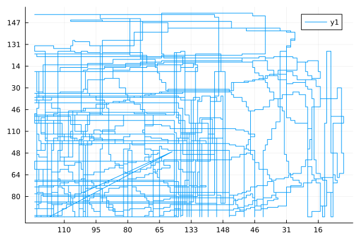

# Advent of Code 2018

2018 was my second year of Advent of Code. I used [Mathematica](https://wjholden.com/aoc/2018/), which was an extremely mixed experience. Mathematica excelled for a very few puzzles, but in general I found it poorly suited for many of the procedural programming puzzles. It was definitely a learning experience. Now, eight years later, I'm finally picking up where I left off, this time using Rust.

# Daily Stars and Themes

1. `##`
2. `##`
3. `##`
4. `##`
5. `##`
6. `##`
7. `**` Queues, ordering, dependencies, parallelism
8. `##`
9. `**` Double-ended queues
10. `##`
11. `##`
12. `##`
13. `#*` Procedural programming, imaginary numbers are not necessary for this, read the instructions!
14. `**` Arrays, bottom-up solutions, searches, vague instructions
15. `**` Hardest day of the hardest year! Procedural programming, long specifications, BFS, bisection
16. `##`
17. `  `
18. `##`
19. `##`
20. `**` Regular expressions, backtracking/stack machines, BFS, shortest-path trees
21. `# `
22. `# `
23. `#*` Geometry, satisfiability
24. `**` Beverage Bandits 2.0? Another simulation with a tricky spec, a challenging input format, bisection search, and a fun idempotence twist.
25. `  `

# Lessons learned

- https://www.reddit.com/r/adventofcode/comments/1qhewn6/rotating_between_eight_directions/
- https://www.reddit.com/r/adventofcode/comments/a4i97s/comment/ebepyc7/ `VecDeque` can rotate!
  This is *much* faster than insertions.
- Are you seeing crazy $x$ and $y$ scales like the below plot (generated by Plots.jl)?
  There might be something in your dataset causing your data to be interpreted
  as strings and not numbers.
- [Day 23](https://adventofcode.com/2018/day/23) is one of at least four Advent of Code puzzles that are well-suited to constraint solvers. (The others are [2023/24](https://adventofcode.com/2023/day/24), allegedly [2024/24](https://adventofcode.com/2024/day/24), and [2025/10](https://adventofcode.com/2025/day/10)). I implemented solutions in [Minizinc](aoc-2018-day23-part2-fast.mzn) and [Z3 with Python](aoc-2018-day23-part2.py). I needed some help from Gemini to get my Minizinc solution fast enough to be usable. My [original Minizinc solution](aoc-2018-day23-part2-slow.mzn) was too slow. Gemini suggested a "Big-M" technique that I had not encountered before. This worked well with the [COIN-BC solver](https://github.com/coin-or/cbc), but to my surprise [Z3](https://github.com/z3prover/z3) worked better with my original problem formulation with absolute values.



```
julia> df2
6675×2 DataFrame
  Row │ 117       95
      │ String31  String15
──────┼────────────────────
    1 │ 118       95
    2 │ 119       95
    3 │ 119       94
    4 │ 119       93
```

# Libraries

# References

- [Rust at Scale: An Added Layer of Security for WhatsApp](https://engineering.fb.com/2026/01/27/security/rust-at-scale-security-whatsapp/)
- [So You Want to Contribute to Rust](https://kivooeo.github.io/blog/first-part-of-contibuting/)
- [Rust Is Beyond Object-Oriented, Part 3: Inheritance](https://www.thecodedmessage.com/posts/oop-3-inheritance/)
- [Stop Forwarding Errors, Start Designing Them](https://fast.github.io/blog/stop-forwarding-errors-start-designing-them/)
- [Maybe Comments SHOULD Explain 'What'](https://www.hillelwayne.com/post/what-comments/)
- https://rustlings.rust-lang.org/

# Todo
- [On Modern Hardware the Min-Max Heap beats a Binary Heap](https://probablydance.com/2020/08/31/on-modern-hardware-the-min-max-heap-beats-a-binary-heap/)
- https://github.com/ConSol-Lab/Pumpkin/issues/336#issuecomment-3665601647
- https://gosub.io/
- https://pico.implrust.com/running.html
- https://ai.palashkantikundu.in/

## Embedded
- [Advent of Code on MCUs](https://www.reddit.com/r/adventofcode/comments/1pwuvdo/upping_the_ante_2025_day_advent_of_code_on_mcus/)
- [Pico Pico - Embedded Programming with Rust](https://pico.implrust.com)
- [Raspberry Pi Pico-series Python SDK](https://datasheets.raspberrypi.com/pico/raspberry-pi-pico-python-sdk.pdf)
- [Mousefood](https://docs.rs/mousefood/latest/mousefood/)

## AI
- [Deep Learning from First Principles](https://ai.palashkantikundu.in/)
